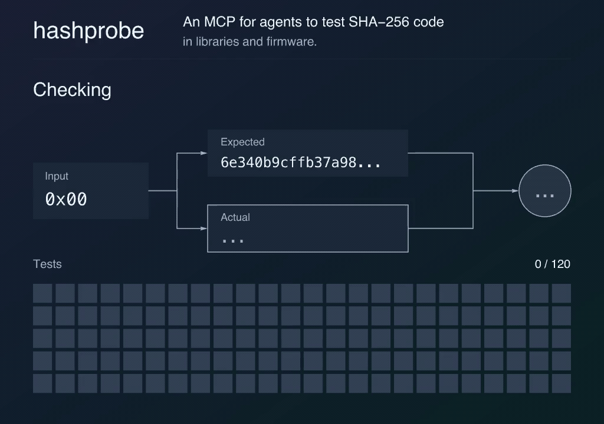

# Hashprobe

[](https://github.com/ArcX-Research/hashprobe/actions/workflows/ci.yml)
[](Makefile)
[](docs/BINARIES.md)
[](LICENSE)
[](https://m8ven.ai/mcp/arcx-research-hashprobe-d02ezj?s=readme)

Hashprobe checks whether a program calculates SHA-256 hashes correctly. It compares results with a reference implementation and saves failing inputs so you can reproduce bugs and test fixes. Use it to test changes to cryptographic libraries, compiler builds, or firmware.

Written in C, Hashprobe runs on your computer from the terminal or as a local MCP server for AI agents. Agents can test configured programs, inspect failures, and rerun tests after a fix.

[](docs/assets/hashprobe.mp4)

[Browser lab](https://hashprobe.dilate.co.ke/) · [MCP guide](mcp/README.md) · [Prebuilt binaries](docs/BINARIES.md)

## Install

Requires macOS or Linux, Git, a C11 compiler, Make, and awk.

```sh
git clone https://github.com/ArcX-Research/hashprobe.git
```

```sh
cd hashprobe
```

Build and install for your user:

```sh
make
```

`make` creates `build/`. Installation copies the commands to `~/.local/bin`.

```sh
make install PREFIX="$HOME/.local"
```

Add this line to `~/.zshrc` or `~/.bashrc` and run it in your current terminal:

```sh
export PATH="$HOME/.local/bin:$PATH"
```

## Connect an agent

After installation, ask an agent with terminal access:

> Hashprobe is installed on this computer. Connect its local MCP server to this app for my user.

Or use your app's setup command below. You need the app's CLI and, for the default test program, OpenSSL.

Codex:

```sh
hashprobe-mcp setup --client codex
```

Claude Code:

```sh
hashprobe-mcp setup --client claude
```

Restart the app, then ask:

> Use Hashprobe to check the openssl target.

See the [MCP guide](mcp/README.md) for other apps and adding your own programs.

## Use the terminal

Test OpenSSL:

```sh
mkdir -p reports
```

```sh
hashprobe check --output binary --report reports/openssl.json \
  -- openssl dgst -sha256 -binary
```

Expect `117 passed`. Each run needs a new report filename. Exit codes: `0` pass, `1` wrong hash, `2` error.

### Test your own program

Replace the command after `--` with your executable or wrapper script. It must read all input bytes from stdin, write only the hash to stdout, and exit with code `0`.

Use 64 hex characters by default, or 32 raw bytes with `--output binary`. Start with the [C example](examples/sha256_target.c). Tested programs run with your user permissions.

Run `hashprobe --help` for options and replaying saved failures.

## Development

Requires Python 3.10 or newer. From the source folder:

```sh
python3 -m venv .venv
```

```sh
.venv/bin/python -m pip install -r mcp/tests/requirements.txt
```

```sh
make test test-mcp test-install PYTHON=.venv/bin/python
```

Check for memory errors:

```sh
make sanitize PYTHON=.venv/bin/python
```

## License

[MIT](LICENSE). See [code origins](PROVENANCE.md) for the reference implementation and included libraries.
